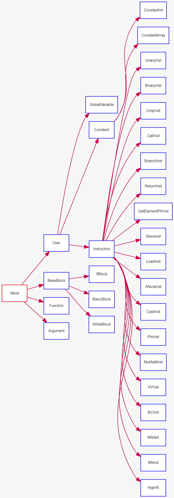

## Report Week 1

### 整体规划

整体规划（根据实际进行进度及时进行调整）

两个月时间，

- 3月内完成整个代码的阅读，理解掌握编译器设计和优化相关知识
  1. 第一周：3/3-3/10：类型，数据结构，HIR三层优化
  2. 第二周第三周：3/10-3/25：中层IR全部Pass
  3. 第四周：3/25-4/1：Machine IR和底层代码生成，寄存器分配
- 4月进行性能分析和优化的分析，并完成论文的设计，根据导师建议进一步修改
  - 4/1-4/8：ptheard，如何使用多个轻量级线程优化编译器，与传统架构的区别

以上规划根据实际情况及时调整，尽量提前完成

### 第一周进展

#### Part1 . 类型系统和数据结构

进展：

阅读《Getting Started with LLVM Core Libraries》前5章，参考LLVM设计，再根据本项目的类继承关系验证，理解了本项目用到的所有基础数据结构和文件组织，并写了文档



文档简要报告：

Value类型含枚举类 `Type` 和其名字

```cpp
explicit Value(Type *ty, const std::string &name = "");
~Value() = default;
```

User 类型记录对Value 的使用，其私有变量包括操作符和其数量

```cpp
std::vector<Value *> operands_; // operands of this value
unsigned num_ops_;
```

IR类型

High IR主要是在基本块级别，与LLVM IR联系不大（本项目的中层IR设计接近LLVM IR）

中层IR分为考虑寄存器分配后的MEM模型和考虑寄存器分配前的SSA模型

但是HIR的组织方式和LLVM IR相同：

1. 模块级：Module类负责聚合编译过程中使用的数据，包含了模块中的所有函数
2. 函数级：Function类聚合这个函数用到的其他基本块集合
3. 基本块：BaseBlock类聚合用到的各条指令，分为以下三种子类
   1. Basic Block：符合单一[入口点](https://zh.wikipedia.org/wiki/入口点)没有[分支](https://zh.wikipedia.org/wiki/分支_(計算機科學))指令，单一结束点的结构
   2. If Block: 包含 `cond` `If Body` `Else Body` 三个可能是这些类中任一个的子块
   3. While Block：包含 `cond` 和 `body`

#### Part 2. HIR及优化

进展：


根据 `main.cc`中`HIR` 层级的 Pass，阅读了右侧文件的代码

1. BBExps
2. HighBlock
3. HIRSimplyCFG
4. LoopMerge
5. AccumulatePattern

并写了文档，简要报告如下：

#### HighBlock.h

在`BaseBlock` 的基础上定义了`If Block` 和`while Block`

此层级保留 if while 等结构的信息，方便在源码层级进行结构变换

#### BBExps

读取Base Block子类，递归的把所有子类分割成 Basic Block，提取其中的指令和表达式，用于后续的累加模式识别

#### HIRSimplyCFG

[LLVM IR Ref](https://www.notion.so/Report-Week-1-4d85834f35a848099be2d54b5bc02114#abc0c3cad2904c9da99a92ecf7edbf70)

根据 `SimplifyCFGPass` 的注释，这个 Pass 完成的有：

- 死代码删除
- Basic Block合并
- 删除没有前驱的基本块（unreachable）
- 如果一个基本块仅有一个前驱且该前驱仅有一个后继，将此基本块与前驱合并
- 消除只有一个前驱的基本块的PHI节点
- 消除仅包含无条件分支的基本块
- 将invoke指令改为调用nounwind函数
- 把形如“if (x) if (y)”的情形改为“if (x & y)”

**但是本项目中，在HIR层级** 仅完成循环合并

如果succbb不为空且能合并把succbb合并到bb：

```cpp
for (auto instr : dynamic_cast<BasicBlock *>(succbb)->getInstructions()) {
      bb->addInstruction(instr);      // 把succ的指令添加到bb
    }
// other case
```

由于循环不变量外提，死代码删除和其他 Pass 很容易产生空基本块，所以本项目中经过Loop Merge和 Accumulate Pattern 之后需要再执行一次CFG优化

### 总结

本周完成了所有数据结构和API的阅读理解，理解本项目的HIR层级是在高级语言层面进行。

阅读了控制流程图，循环代码合并，基本块代码合并的优化部分的代码

同时阅读学习了编译原理中的[支配节点算法](A Simple, Fast Dominance Algorithm)https://www.cs.rice.edu/~keith/EMBED/dom.pdf，SSA中为何要设置 $φ$ 节点，为后续的中层IR级别也就是类似LLVM IR级别的 pass 代码阅读做基础