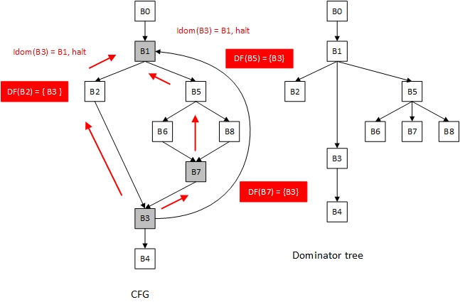

# Report Week 3

本周进度

1. 学习了支配树有关算法及在编译器设计的应用
2. 阅读了项目的支配边界计算，正在学习PHI节点计算，Mem to Reg的过程
3. 设计了一个例子：根据求最大公约数的算法，分析了用到的pass前后的IR形式

- Dominance 是Analysis类，分析的结果用于SSA的Mem2Reg Pass（是Transform类

## Dominance

定义：
$$
\text{DOM}(n)=\{n\} \cup\left ( \mathop{\cap}\limits_{m \in preds(n)}  \text{DOM}(m) \right)
$$
数据流方程很容易理解，支配n的节点就是n和支配m的节点的并集，其中m为n的前驱

由此，在对当前节点（BasicBlock）进行求值之前，应该让当前节点的所有前驱节点（Prev Basic Block）在本次迭代中都应该求值完成，否则还要放到下次迭代来进行值的更新，这要会增加一次迭代过程。

求迭代数据流分析问题，对于前向数据流：可以对求值过程进行适当排序，使算法经过很少的迭代就能收敛。逆后序可以节约迭代的次数

何为 Reverse Post Order

A postorder traversal visits as many of a node’s children as possible, in a consistent order, before visiting the node. (In a cyclic graph, a node’s child may also be its ancestor).

An reverse postorder(RPO) traversal is the opposite - it visits as many of a node’s predecessors as possible before visiting the node itself.

有点像拓扑排序

如果按照基本块的节点次序求解：


表格[Dominance](https://www.notion.so/7e942cbe5d594fb9a0f94182098581bf)

如果能够安排 B5 B6 B8 B7 在 B3 之前进行求值，就更能得到“全局”的信息，也即B3的所有前驱

这样的方式可以把迭代次数从3次减少至2次

因此我们需要逆后序的遍历整个CFG

```cpp
void Dominators::createReversePostOrder(Function *f) {  // 逆后序
  reversePostOrder_.clear();
  postOrderID_.clear();
  std::set<BasicBlock *> visited;
  postOrderVisit(f->getEntryBlock(), visited);
  reversePostOrder_.reverse();
}

// data structure
class Dominators:{
private:
	std::list<BasicBlock *> reversePostOrder_;
  std::map<BasicBlock *, int> postOrderID_; // the root has highest ID
};

void Dominators::postOrderVisit(BasicBlock *bb, std::set<BasicBlock *> &visited) {
	//从bb开始一趟深度优先遍历
  visited.insert(bb);
  for (auto b : bb->getSuccBasicBlocks()) {
    if (visited.find(b) == visited.end())  // 如果未访问过
      postOrderVisit(b, visited);
  }
  // 节点的后继都访问完毕时
  // 对子节点从深到浅编号
  postOrderID_[bb] = reversePostOrder_.size();
  reversePostOrder_.push_back(bb);
}
```

可以看出就是深度优先遍历

### Phi节点

在生成SSA的时候，需要计算在何处插入正确的 $\phi$，所有的有多个前驱的Basic Block的开头都可能需要插入 $\phi$，但是这种方法会插入很多的无用的  $\phi$ ，为了减少不必要的开销，哪些BB的开头需要插入

举例，上方CFG图中，B2处变量的定义不能支配B3处该变量的使用，所以需要插入phi指令

> In SSA form, definitions must dominate uses.

**变量定义的支配边界确定 Φ 的插入位置**

支配树：只保留立即支配关系，删除CFG中其他边，就得到支配树：支配树中每个节点的祖先都**严格支配**这个节点（支配关系的可传递性）


如何构建支配树？需要IDOM：父节点和子节点是立即支配关系，祖先和子节点是支配关系

立即支配节点：，**d** 严格支配节点 **n**，却不支配任何严格支配节点 **n** 的其他节点。不是所有的节点均有立即支配点，如开始节点就没有

由于每个definition支配对应的uses，所以如果达到了definition所在Basic Block的支配边界，就必须考虑其他路径是否有其他相同变量的赋值或定义。

- 一个节点 **d** 的可支配边界是一个点集，其中任意节点n均满足， **d** 能严格支配 n 的所有立即前驱，却不能严格支配 **n**。支配边界就是 **d** 支配能力的极限（不包含
- 一个支配树是一棵树，它的所有节点儿子是被其最近支配的所有节点。由于最近必经点是唯一的，故其为一棵树，开始节点即为树根


### Dominator Tree

计算支配树的算法就是前文中提到的数据流方程，把支配问题看作前向数据流分析问题：

$$\text{DOM}(n)=\{n\} \cup\left ( \mathop{\cap}\limits_{m \in preds(n)}  \text{DOM}(m) \right)$$

前文已经分析过：按照逆后序遍历收敛速度更快

```cpp
void Dominators::run() {
  for (auto f : m_->getFunctions()) {
    if (f->getBasicBlocks().size() == 0)
      continue;
    createReversePostOrder(f);
    createIDom(f);
    createDominanceFrontier(f);
    createDomTreeSucc(f);
  }
}
```

从数据流方程得到的算法，再根据《A Simple, Fast Dominance Algorithm》算法改进

- 不将每个结点的初试支配结点定义为全集。对于 ***entry*** 结点定义 ***entry***，对于其他结点定义为空（***undefined***）。
- 不直接计算结点 ***n*** 的支配集合 ***Dom(n)*** 。而是计算结点 ***n*** 的直接支配结点 ***IDom(n)***

伪代码：


知道了每个结点的 IDom 信息，就可以构造出支配树进而计算出支配边界，依旧以图1为例：

后序遍历（一个深度优先的实现）：B4 B3 B2 B7 B8 B6 B5 B1 B0

逆后序（求IDom时的顺序）：B0 B1 B5 B6 B8 B7 B2 B3 B4

逆后序可以保证求某个节点的立即支配的时候，它的前驱们的支配节点已经被计算过

```cpp
void Dominators::createIDom(Function *f) {
  // init
  for (auto bb : f->getBasicBlocks())
    bb->setIDom(nullptr);
  auto root = f->getEntryBlock();
  root->setIDom(root);

  // iterate
  bool changed = true;
  while (changed) {
    changed = false;
    for (auto bb : this->reversePostOrder_) {  // 按照逆后序
      if (bb == root) {
        continue;
      }

      // find one pred which has idom
      BasicBlock *pred = nullptr;
      for (auto p : bb->getPreBasicBlocks()) {
        if (p->getIDom()) {
          pred = p;
          break;
        }
      }
      exit_ifnot(_assertPredFalse_createIDom_Dominators, pred);

      BasicBlock *new_idom = pred;
      for (auto p : bb->getPreBasicBlocks()) {
        if (p == pred)
          continue;
        if (p->getIDom()) {
          new_idom = intersect(p, new_idom);
        }
      }
      if (bb->getIDom() != new_idom) {
        bb->setIDom(new_idom);
        changed = true;
      }
    }
  }
}
```

intersect函数就是求两个节点在CFG中的最近公共祖先

```cpp
// find closest parent of b1 and b2
BasicBlock *Dominators::intersect(BasicBlock *b1, BasicBlock *b2) {
  while (b1 != b2) {
    while (postOrderID_[b1] < postOrderID_[b2]) {
      exit_ifnot(_getIDomFalse_intersect_Dominators, b1->getIDom());
      b1 = b1->getIDom();
    }
    while (postOrderID_[b2] < postOrderID_[b1]) {
      exit_ifnot(_getIDomFalse_intersect_Dominators, b2->getIDom());
      b2 = b2->getIDom();
    }
  }
  return b1;
}
```

以文中给出的例子说明：这里 6 5 4 3 2 1 是图的一个逆后序遍历


同样根据《A Simple, Fast Dominance Algorithm》，支配边界的计算伪代码：


可见支配边界出现在 **join** 节点

计算支配边界

支配边界：Y 是 X 的支配边界，当且仅当 X 支配 Y 的一个前驱结点同时 X 并不严格支配 Y

```cpp
void Dominators::createDominanceFrontier(Function *f) {
  for (auto bb : f->getBasicBlocks()) {
    if (bb->getPreBasicBlocks().size() >= 2) {
      for (auto p : bb->getPreBasicBlocks()) {
        auto runner = p;
        while (runner != bb->getIDom()) {
          runner->addDominanceFrontier(bb);
          runner = runner->getIDom();
        }
      }
    }
  }
}
```

举例（图片来自https://zhuanlan.zhihu.com/p/24405332）

灰色节点是 join node 即需要计算的地方



以此图为例，B1，B3，B7是join node，计算B3时，bb=B3, p = <B2,B7>, 设runner= B2

由于B3的前驱B2不立即支配B3，所以B3包含于B2 的支配边界中，按照算法更新runner为B2 的立即支配 B1： `runner = runner->getIdom();` 再检查，B1是B3 的立即支配，则这条路径的循环结束，runner更新为B7

注：关于basic block的数据结构基础

```cpp
std::set<BasicBlock *> doms_;        // dominance set
BasicBlock *idom_ = nullptr;         // immediate dominance
std::set<BasicBlock *> domFrontier_; // dominance frontier set
std::set<BasicBlock *> domTreeSuccBlocks_;    // domianate blocks
```

举例：

## MIR_SSA

关键步骤，插入PHI函数

最简单的方法就是每个 join node 处把其用到的所有变量都设一条 Phi 函数，有了支配边界以后，只需要在变量 x 定义的基本块 bb 的支配边界的所有节点处插入 x 的 Phi 函数

```cpp
void Mem2RegPass::run() {
  for (auto f : m_->getFunctions()) {
    func_ = f;
    if (func_->getBasicBlocks().size() >= 1) { // 有可能需要phi
	  	// debug 时发现putint getint _start_ 这些声明在外部的库函数会continue
      GenPhi();
      ReName(func_->getEntryBlock());
    }
		// ...合并bb的指令
		**m_->setIRLevel(Module::MIR_SSA);**
}
```

生成Phi指令《Data Flow Analysis Theory and Practice》

算法伪代码：


```cpp
void Mem2RegPass::GenPhi() {
  std::set<Value *> globals;
  std::map<Value *, std::set<BasicBlock *>> var_blocks;
  // ...

  std::map<BasicBlock *, std::set<Value *>> bb_phis;
  builder = new IRBuilder(nullptr);

  for (auto var : globals) {
    std::vector<BasicBlock *> work_list;
    work_list.assign(var_blocks.find(var)->second.begin(),
                     var_blocks.find(var)->second.end());
    for (int i = 0; i < work_list.size(); i++) {
      auto bb = work_list[i];
      for (auto bb_df : bb->getDominanceFrontier()) {
        if (bb_phis.find(bb_df) != bb_phis.end()) {
          builder->SetInsertPoint(bb_df);
          if (bb_phis.find(bb_df)->second.find(var) !=
              bb_phis.find(bb_df)
                  ->second.end()) { // have phi for bb_df and var
                                    // std::cout<<"have"<<std::endl;
          } else {                  // not have
            auto phi =
                builder->CreatePhi(var->getType()->getPointerElementType());
            phi->setLVal(var);
            bb_df->insertInstr(*bb_df->getInstructions().begin(), phi);
            // std::cout<<"insert";
            work_list.push_back(bb_df);
            bb_phis.find(bb_df)->second.insert(var);
          }
        } else { // not have
          auto phi =
              builder->CreatePhi(var->getType()->getPointerElementType());
          phi->setLVal(var);
          bb_df->insertInstr(*bb_df->getInstructions().begin(), phi);
          // std::cout<<"insert";
          work_list.push_back(bb_df);
          bb_phis.insert({bb_df, {var}});
        }
      }
    }
  }
  // func_->print();
}
```

变量重命名

CSE 401/M501


寄存器分配

代码生成的三个部分

1. 指令选择：IR映射到汇编代码
2. 寄存器分配
3. 指令调度

寄存及分配是可以存在于多个层级的，如

1. 表达式树
2. 局部（Basic Block内）
3. 循环内
4. 全局的
5. 程序之间

CS153

[课程SSA pdf](https://www.seas.harvard.edu/courses/cs153/2018fa/lectures/Lec23-SSA.pdf)