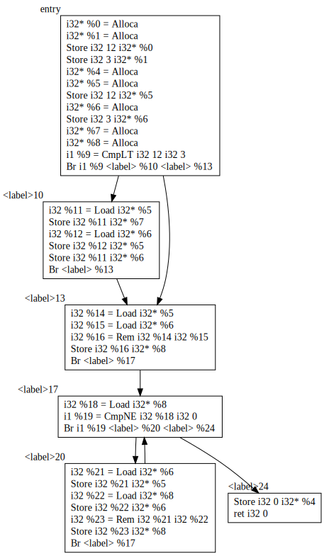
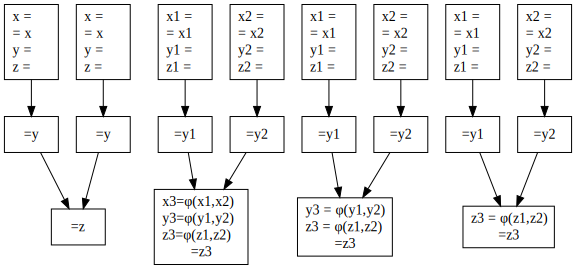
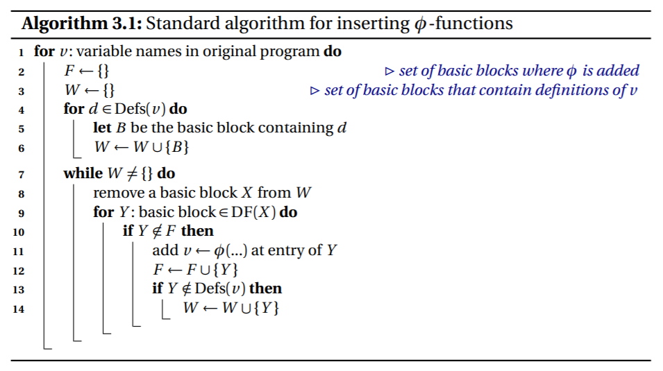
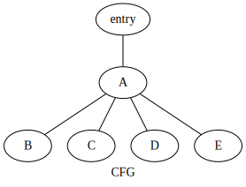

# Report Week 4

本周主要工作：项目中如何构建REG SSA

​	构造SSA的两个基本步骤

1. 插入 $\phi$ 函数
2. 变量重命名

```cpp
void Mem2RegPass::run() {
  for (auto f : m_->getFunctions()) {
    if (f->getBasicBlocks().size() >= 1) {
      GenPhi();
      ReName(f->getEntryBlock());
    }
  // code for delete Alloca and Store Instruction

  m_->setIRLevel(Module::MIR_SSA);
}	
```



这是用通过内存实现的 SSA ，为了后续的寄存器分配工作，应把 Alloca 和 Load 指令直接分配（虚拟）寄存器

在哪里放置 $\phi$ 函数

朴素的想法：每当节点 $x$ 包含一个变量 $a$ 的定义时，所有 $x$ 的支配边界中的节点 $z$ 都应该插入一条关于 $a$ 的 $\phi$ 函数。这种方法被称为：最小静态单赋值形式 (minimal SSA) 

最小静态单赋值形式有以下特点：同一原始名字的两个不同定义的路径汇合处都会插入一个 $\phi$ 函数。这样的构造方法显然符合SSA的两个要求

然而，有些 $\phi$ 函数可能会变成无用的代码，最小化SSA并不一定生产最少数量的 $\phi$ 函数。为减少 $\phi$ 函数的数量，基于以下观察：$\phi$ 函数的变量只在$\phi$ 函数所在基本块中被需要时才是必须的，即该变量在此基本块中**活跃（live）**，因此，在插入 $\phi$ 函数的阶段，使用活跃变量信息（Live variable information）来决定 $\phi$ 函数是否需要，以此方法建构一个精简的SSA，又称为**剪枝的SSA**

如果为了减少分析开销和实现复杂度，可以采取折中的办法，**半剪枝的SSA**，在建构时，去掉不跨越基本块的变量名，即如果某个变量只在局部使用，就不用给它设计 $\phi$ 函数

鉴于半剪枝SSA实现简单又可以提高性能，所以本项目使用半剪枝SSA



$\phi$ 函数具体构建方法：对变量 t ，包含 t 定义的基本块集合，求支配边界，在支配边界处插入 $\phi$ 函数，因为 $\phi$ 函数本身也是定义，所以这个过程应该是迭代求S的DF正闭包

$$
\bold{Let.} \quad DF_1(S)=DF(S)\\DF_{i+1}(S)=DF(S\cup DF_i(s)) \\ \bold{Iterated \space\space Dominance \space\space Frontier.}
\quad DF_{∞}(S)
$$
三种SSA的构造伪代码见附件

[assert/week4/PseudoCode_AlgorithmTemplate.pdf](assert/week4/PseudoCode_AlgorithmTemplate.pdf)

### 插入Φ 节点

伪代码：

W: work list, 需要进行计算的包含 x 的定义的BB，即还没插入 $\phi$ 函数的节点

F:  指已经被插入了 $\phi$ 函数的节点，不需要重复插入



以此CFG图为例说明变量 $x$ 的计算过程

1. 初始化，W={ }，F={ }
2. for loop, W = { B, C, D }
3. X = B, DF(B) = { D }
4. Y = D, D 未访问过
5. 把 D 加入F, 在 D 中插入φ
6. φ本身也是新的定义，
所以把 D 并入W
7. X = C, DF(X) = { D, E }
8. Y = D, D访问过，继续
9. Y= E, E 未放问过
10. 把 E 并入F，在 E 中插入φ
11. ...


这个过程可以汇总为表格：

[placement of φ for variable x ](https://www.notion.so/98613e55afa34f4ebfdc26b0b686ed49)

### 项目中的GenPhi代码

本项目采用半剪枝的SSA，即只对"全局"的变量生成 $\phi$ 函数

第一步，求“全局”变量

```cpp
void Mem2RegPass::GenPhi() {
  std::set<Value *> globals;
  std::map<Value *, std::set<BasicBlock *>> var_blocks; //map: varname -> block
  for (auto bb : func_->getBasicBlocks()) {
    std::set<Value *> var_kill;
    for (auto instr : bb->getInstrList()) {
      if (instr->getInstrType() == Instruction::Store) {
        auto r_val = static_cast<StoreInst *>(instr)->getRVal();
        auto l_val = static_cast<StoreInst *>(instr)->getLVal();
        auto glob = dynamic_cast<GlobalVariable *>(l_val);
        auto ins = dynamic_cast<GetElementPtrInst *>(l_val);
        if (!glob && !ins) {
          if (var_kill.find(r_val) == var_kill.end()) {
						// 如果当前基本块没有对 r_val 进行过定值
						// 也即，在定义前就被使用了，说明这个变量的活跃期跨越了基本块
            globals.insert(l_val);
          }
          var_kill.insert(l_val);
					// 这条Store语句会产生一个对 l_val 的定值

          if (var_blocks.find(l_val) == var_blocks.end()) {
            var_blocks.insert({l_val, {bb}});
          } else {
            var_blocks.find(l_val)->second.insert(bb);
          }
        }
      }
    }
  }

```

全局变量

```cpp
globals: 0 // 函数的参数 
globals: 1 // 函数的参数 
globals: 6 // label 10,20 中直接使用%6 
globals: 5 // label 10,20 中直接使用%6
globals: 8 // label 13,20 中直接使用%8
globals: 7 // label 10,20 中直接使用%7
globals: 4 // label 24 中直接使用%4
```

第二步，根据变量的worklist迭代

```cpp
for (auto var : globals) {
std::vector<BasicBlock *> work_list;
work_list.assign(var_blocks.find(var)->second.begin(),
                 var_blocks.find(var)->second.end());
//init with define bolcks

for (int i = 0; i < work_list.size(); i++) {
  auto bb = work_list[i];
  for (auto bb_df : bb->getDominanceFrontier()) {
    if (bb_phis.find(bb_df) == bb_phis.end()) { // not have phi 
      auto phi = builder->CreatePhi(var->getType()->getPointerElementType());
      phi->setLVal(var);
      bb_df->insertInstr(*bb_df->getInstructions().begin(), phi);
      // std::cout<<"insert";
      work_list.push_back(bb_df); // 新的phi也应该作为define加入worklist
      bb_phis.insert({bb_df, {var}});
    }
		
		else{
      builder->SetInsertPoint(bb_df);
      if (bb_phis.find(bb_df)->second.find(var) !=
          bb_phis.find(bb_df)
              ->second.end()) { // have phi for bb_df and var
        // std::cout<<"have"<<std::endl;
      } else {                  // not have
        auto phi =
            builder->CreatePhi(var->getType()->getPointerElementType());
        phi->setLVal(var);
        bb_df->insertInstr(*bb_df->getInstructions().begin(), phi);
        // std::cout<<"insert";
        work_list.push_back(bb_df);
        bb_phis.find(bb_df)->second.insert(var);
      }
    } 
  }
}
```

以%6为例，entry能支配任意节点，而label 10中的定义支配边界是13，所以在6的worklist中插入13，label 13中的定义支配边界是17，所以在6的worklist中插入17

```python
varname: 0 work_list: entry

varname: 1 work_list: entry

varname: 6 work_list: entry 10 20
insert
varname: 6 work_list: entry 10 20 13
insert
varname: 6 work_list: entry 10 20 13 17

varname: 5 work_list: entry 10 20
insert
varname: 5 work_list: entry 10 20 13
insert
varname: 5 work_list: entry 10 20 13 17

varname: 8 work_list: 13 20
insert
varname: 8 work_list: 13 20 17

varname: 7 work_list: 10
insert
varname: 7 work_list: 10 13

varname: 4
work_list: 24
```

### 变量重命名

当看到某个变量出现在赋值语句的左侧，应该为其创建一个新的Version，即新名字

当看到某个变量出现在赋值语句的右侧，应该更新其下标为恰当的define

对于平铺直叙的代码，左值，`x.NewName = x.counter++`，右值，`x.name = x.counter`

然而实际情况会有控制流，如何确定 `counter`  对应的名字是否有效？有没有被其他边流过来的定义覆盖掉

变量重命名：对于每个定义或使用，都应该赋以合适的值，这个过程可以在支配树的一次深度优先遍历中完成，对于当前基本块，头部的 $\phi$ 函数作为一个定义需要被分配一个新的名字，然后对于基本块内每个操作，源操作数应该被赋值为最新的名字，目的操作数也应该被分配一个新的名字

当前块的操作完成后，访问CFG图中后继节点开头的 $\phi$ 函数，修改它们的参数，使用最新的变量名

然后对支配树中的子块进行递归


初始化：对于每一个名字：`counter = 0; stack = []`

分配NewName：把变量 x 的counter[x] 当前值作为下标返回，`conter[x]++; stack[x].push(i)`

- 对于entry内每一个 $x\leftarrow \phi(\cdots)$ 函数，把 x 分配一个NewName
- 对于entry内每一个形如 $x \leftarrow y \space\text{op} \space z$ 的操作，把 y 和 z 更新为它们对应栈顶的下标，给 x NewName
- 对于每个entry块的后继block，用 x 填充它们的 $\phi$ 函数的参数
- 对于后继的block，递归此过程
- 此时，把数据结构恢复到递归之前的状态

同样以上方CFG为例说明


图中支配树为： 



[Rename for variable x](https://www.notion.so/db9bd16a80734754acadb6429378ad93)

项目中实现代码

```cpp
std::map<Value *, std::vector<Value *>>   newest_live_var;    // map: value -> stack
void Mem2RegPass::ReName(BasicBlock *bb) {
  std::vector<Instruction *> wait_delete;
  for (auto instr : bb->getInstructions()) {
    if (instr->isPHI()) {
      auto l_val = static_cast<PhiInst *>(instr)->getLVal();
      if (newest_live_var.find(l_val) == newest_live_var.end()) {
        newest_live_var.insert({l_val, {instr}});   // New Name
      } else {
        newest_live_var.find(l_val)->second.push_back(instr);
      }
    }
  }

  for (auto instr : bb->getInstructions()) {
    if (instr->getInstrType() == Instruction::Load) {  
      auto l_val = static_cast<LoadInst *>(instr)->getLVal();
      auto glob = dynamic_cast<GlobalVariable *>(l_val);
      auto ins = dynamic_cast<GetElementPtrInst *>(l_val);
      if (!glob && !ins) {
        if (newest_live_var.find(l_val) != newest_live_var.end()) {
          auto iter = newest_live_var.find(l_val);
          auto newest_val = iter->second[iter->second.size() - 1];
          for (auto use : instr->getUseList()) {
              static_cast<User *>(use.val_)->setOperand(use.arg_no_, newest_val);
          }
          wait_delete.push_back(instr);
        } 
      }
    }
    if (instr->isStore()) {
      auto l_val = static_cast<StoreInst *>(instr)->getLVal();
      auto r_val = static_cast<StoreInst *>(instr)->getRVal();
      auto glob = dynamic_cast<GlobalVariable *>(l_val);
      auto ins = dynamic_cast<GetElementPtrInst *>(l_val);
      if (!glob && !ins) {
        if (newest_live_var.find(l_val) != newest_live_var.end()) {
          newest_live_var.find(l_val)->second.push_back(r_val);
        } else {
          newest_live_var.insert({l_val, {r_val}});
        }
        // delete alloca store
        wait_delete.push_back(instr);
      }
    }
  }

  for (auto succ_bb : bb->getSuccBasicBlocks()) {
    for (auto instr : succ_bb->getInstructions()) {
      if (instr->isPHI()) {
        auto l_val = static_cast<PhiInst *>(instr)->getLVal();
        if (newest_live_var.find(l_val) != newest_live_var.end()) {
          if (newest_live_var.find(l_val)->second.size() != 0) {
            auto newest_val =
                newest_live_var.find(l_val)
                    ->second[newest_live_var.find(l_val)->second.size() - 1];
            static_cast<PhiInst *>(instr)->setParams(newest_val, bb);
          }
        }
      }
    }
  }

  for (auto dom_succ_bb : bb->getDomTreeSuccBlocks()) {
    ReName(dom_succ_bb);
  }

  for (auto instr : bb->getInstructions()) {
    if (instr->isStore() || instr->isPHI()) {
      if (instr->isStore()) {
        auto l_val = static_cast<StoreInst *>(instr)->getLVal();
        auto glob = dynamic_cast<GlobalVariable *>(l_val);
        auto ins = dynamic_cast<GetElementPtrInst *>(l_val);
        if (!glob && !ins) {
          newest_live_var.find(l_val)->second.pop_back();
        }
      } else {
        auto l_val = static_cast<PhiInst *>(instr)->getLVal();
        if (newest_live_var.find(l_val) != newest_live_var.end()) {
          newest_live_var.find(l_val)->second.pop_back();
        } else {
          exit_ifnot(_GenPhi_Mem2RegPass, false);
        }
      }
    }
  }

  builder->SetInsertPoint(bb);
  for (auto ins : wait_delete) {
    builder->deleteInstr(ins);
  }
}
```

### 寄存器分配算法

本项目使用图着色法

后端

1. 指令选择
2. 指令调度
3. 寄存器分配

Interface Graph图中的每个节点代表某个变量的活跃期或生存期（Live range）。活跃期定义是从变量第一次被定义（赋值）开始，到它下一次被赋值前的最后一次被使用为止。两个节点之间的边表示这两个变量活跃期因为生命期（lifetime）重叠导致互相冲突或干涉。一般说来，如果两个变量在函数的某一点是同时活跃（live）的，它们就相互冲突，不能占有同一个寄存器。

[https://www.zhihu.com/question/56005792/answer/147558407](https://www.zhihu.com/question/56005792/answer/147558407)

图着色算法：[https://web.eecs.umich.edu/~mahlke/courses/583f12/reading/chaitin82.pdf](https://web.eecs.umich.edu/~mahlke/courses/583f12/reading/chaitin82.pdf)

线性扫描算法：[https://www2.seas.gwu.edu/~hchoi/teaching/cs160d/linearscan.pdf](https://www2.seas.gwu.edu/~hchoi/teaching/cs160d/linearscan.pdf)

偏向CISC指令集的Second chance binpacking算法

SSA形式带来的优点就是能有效的降低单个interval的长度，这在CISC指令集计算机中会非常有效。同时，充分利用SSA形式的IR的稀疏特性，避免迭代式的liveness analysis。有效的降低时间复杂度。

[http://citeseerx.ist.psu.edu/viewdoc/download?doi=10.1.1.162.2590&rep=rep1&type=pdf](http://citeseerx.ist.psu.edu/viewdoc/download?doi=10.1.1.162.2590&rep=rep1&type=pdf)