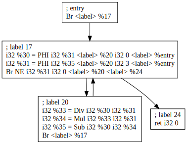
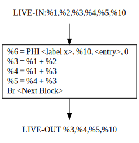
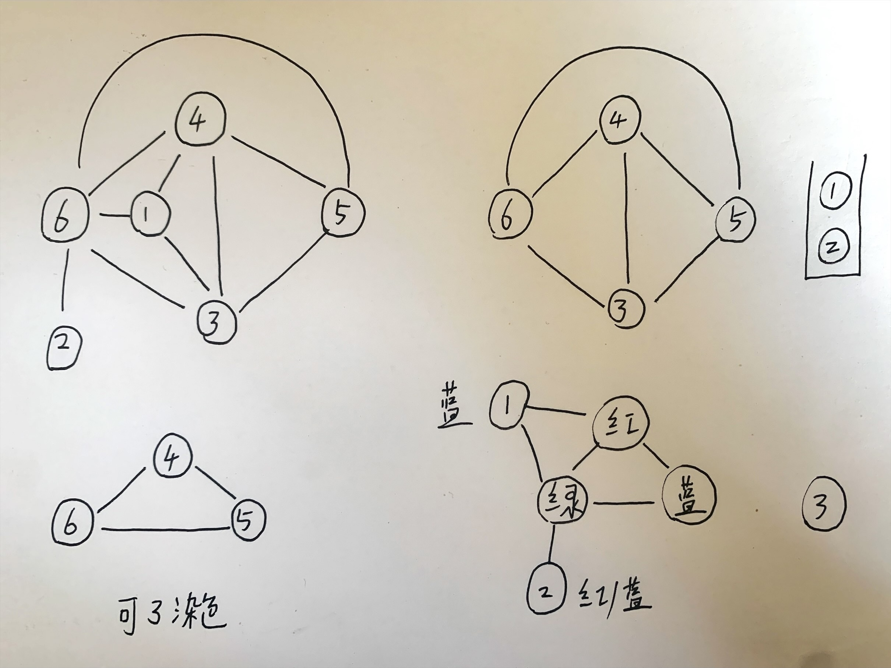

## Report Week 5

本周：寄存器分配初版算法，图染色分配算法

寄存器分配：

为了实现程序的 define 和 use 两个操作，需要保证某个变量在 use 时其 Value 可以被访问到

1. 可以把这个值存在栈上，简单，与物理寄存器无关，如JVM
2. 把值存在寄存器上，整个def-use的 live-range 这个寄存器都不应该被覆盖
   - 当一个 value 不再被使用，那么可以复用其寄存器
   - 两个 value 不能同时使用一个寄存器

如第一种方式对以下程序

```cpp
a = b + c;
d = a;
c = a + d;
```

栈上内存示意图：

```
+------------+
| last func  |  fp + 4
|------------|
|     fp     |  fp + 0
|------------|
| return add |  fp - 4
|------------|
|     a      |  fp - 8
|------------|
|     b      |  fp - 12 
|------------|
|     c      |  fp - 16
|------------|
|     d      |  fp - 20
+------------+
```

程序

```assembly
lw $t0, -12(fp)
lw $t1, -16(fp)
lw $t2, $t0, $t1
sw $t2 ,-8(fp)

lw $t0, -8(fp)
sw $t0, -20(fp)

lw $t0, -8(fp)
lw $t1, -20(fp)
add $t2, $t0, $t1
sw $t2, -16(fp)
```

问题：如何把数量没有限制的 虚拟 寄存器映射到固定数量的 物理 寄存器，且保证每两个相交的 live-range 不能分配到同一个寄存器

目标：使得获取数据的开销最小（内存load&store，寄存器 move 尽可能少

寄存器分配的“范围”

- 表达式级（Expression）
- Local （Basic Block）
- ⭐Loop
- ⭐Global
- 程序之间（Interprocedural）

其中循环和整个程序（全局）级别比较重要，所以要尤其考虑循环中的局部寄存器分配

1. 可以通过估计在基本块或循环中分配变量的收益，来判断如何赋值
2. 分配寄存器给可以达到最大收益的变量（即move开销最小
3. 成本估计值是执行频率的函数（启发式方法）

寄存器分配的主要思想

分配的对象

- 变量
- Live Range
- Values → 定义
- Webs → du - chain

问题描述：

输入：一个有 N 个节点，k 种可选颜色的无向图

图的k染色问题是一个NP难问题，但是对于寄存器分配，可以设计启发式函数

1. 如果max degree of nodes < k 那么总是能染色
   1. 把最大度数的节点删去，其他节点各分配一种颜色，至少会留下一种颜色给这个度数最大的节点
   2. 所以所有节点都能被染色
2. 如果max degree of nodes ≥ k 也是有可能 k 染色的
   1. 最简单的例子：星型图，不管度数多大，两色即可

算法流程

1. 把所有度数小于N的节点压栈（从图中暂时删除）同时删去邻边
2. 当图中所有节点度数大于N时，用启发式函数找到最应该被抛出的那个节点，删去此节点
3. 重复上述两个步骤直到图为空
4. 逐个弹出栈中元素，它们都是可染色的
5. 对于那些被删除的节点（暂时spill）两种解决方案
   1. Chaitin 的原始算法认为这种节点只能抛出
   2. Briggs 改进算法认为可以通过 split 分裂一个live range 为多个来实现重新染色

### 实现

数据结构：

冲突图 Interface Graph `std::map<Value *, std::set<Value *>> IG;`

基本块内活跃范围：`remain[]`

查找所有变量

```cpp
// find all vars
    for (auto &args : func->getArgs()) {
      values.insert(args);
    }
    for (auto &bb : func->getBasicBlocks()) {
      for (auto &inst : bb->getInstructions()) {
        if (inst->getType()->getSize() > 0) {
          values.insert(inst);
        }
      }
    }

int Type::getSize(bool extended) {
  if (this->isIntegerTy()) {
    auto bits = static_cast<IntegerType *>(this)->getNumBits() / 8;
    return bits > 0 ? bits : 1;
  }
  if (this->isArrayTy()) {
    auto element_size =
        static_cast<ArrayType *>(this)->getElementType()->getSize();
    auto num_elements = static_cast<ArrayType *>(this)->getNumOfElements();
    return element_size * num_elements;
  }
  if (this->isPointerTy()) {
    if (extended && this->getPointerElementType()->isArrayTy()) {
      return this->getPointerElementType()->getSize();
    } else {
      return 4;
    }
  }
  return 0;
}
```



LIVE_IN LIVE_OUT 集合算法

```cpp
for (auto &v : values) {
    std::queue<BasicBlock *> Q;
    if (!dynamic_cast<Instruction *>(v)) {  // use
      live_in[func->getEntryBlock()].insert(v);
      Q.push(func->getEntryBlock());
      live_in[Q.front()].insert(v);
    } else {  // define
      auto bb = dynamic_cast<Instruction *>(v)->getParent();
      for (auto &succ_bb : bb->getSuccBasicBlocks()) {
        Q.push(succ_bb);
        live_in[succ_bb].insert(v);
      }
    }
    while (!Q.empty()) {
      auto x = Q.front();
      Q.pop();
      for (auto &succ_bb : x->getSuccBasicBlocks()) {
        if (!live_in[succ_bb].count(v)) {
          live_in[succ_bb].insert(v);
          Q.push(succ_bb);
        }
      }
    }
  }
LIVE IN:
  BB:17  %31 %30 %33 %34 %35  
  BB:20  %31 %30 %33 %34 %35 
  BB:24  %31 %30 %33 %34 %35 
LIVE OUT:
  BB:17  %31 %30 
  BB:20  %31 %35
```

Interference Graph图创建

```cpp
{
      for (auto &i : func->getArgs()) {
        for (auto &j : func->getArgs()) {
          if (i != j) {
            IG[i].insert(j); 
          }
        }
      }
      for (auto &bb : func->getBasicBlocks()) {
        std::set<Value *> living = live_in[bb];
        std::map<Value *, int> remain;
        // get initial remain
        for (auto &v : live_in[bb]) {
          bool flag = true;
          for (auto &inst : bb->getInstructions()) {
            for (auto &op : inst->getOperands()) {
              if (op == v && !inst->isPHI()) {
                remain[v]++;
              }
            }
            if (inst == v) {
              flag = false;
              break;
            }
          }
          if (flag) {
            if (live_out[bb].count(v)) {
              remain[v]++;
            }
          }
        }
        // connect all phis
        {
          std::set<Value *> phis;
          for (auto &inst : bb->getInstructions()) {
            if (inst->isPHI()) {
              phis.insert(inst);
            }
          }
          for (auto &i : phis) {
            for (auto &j : phis) {
              if (i != j) {
                IG[i].insert(j);
              }
            }
          }
        }
        // process all insts
        for (auto &inst : bb->getInstructions()) {
          if (!inst->isPHI()) {
            for (auto &op : inst->getOperands()) {
              if (remain[op]) {
                remain[op]--;
              }
            }
          }
          if (values.count(inst)) {
            // get context active vars
            if (inst->isCall()) {
              this->context_active_vars[inst].insert(nullptr);
              for (auto &i : living) {
                if (remain[i]) {
                  this->context_active_vars[inst].insert(i);
                }
              }
            }
            // add edges
            for (auto &i : living) {
              if (remain[i]) {
                assert(inst != i);
                IG[inst].insert(i);
                IG[i].insert(inst);
              }
            }
            // process living and remain
            living.insert(inst);
            auto insts = bb->getInstructions();
            for (auto it = insts.rbegin(); it != insts.rend(); it++) {
              auto inst_next = *it;
              if (inst_next->isPHI()) {
                continue;
              }
              if (inst_next == inst) {
                break;
              }
              for (auto &op : inst_next->getOperands()) {
                if (op == inst) {
                  remain[inst]++;
                }
              }
            }
            if (live_out[bb].count(inst)) {
              remain[inst]++;
            }
          }
        }
      }
    }
```

举例



初始化：变量和它们的remains

```
%1 +1 +1    = 2
%2 +1       = 1
%3 0
%4 0
%5 0
%6 +1       = 1
%10
```

第一条指令%6 和 %1 %2 冲突

第二条指令%3 和 %1 %2 %6冲突

```
%1 +1 +1    -1 = 1
%2 +1 -1       = 0

//living and remain
%3 +1 +1 +1    = 3
```

第三条指令%4 和 %1 %3 %6冲突

```
%1 +1 +1    -1 -1 = 0
%3 +1 +1 +1 -1    = 2
//living and remain
%4 +1 = 1
```

第四条指令%5 和%3 %4 %6冲突

```
%3 +1 +1 +1 -1 -1 = 1
//living and remain
%4 +1 = 1
%5 +1 = 1
```

可以得到冲突图并进行染色



接下来的两种办法

1. spill
2. split 从图中直观看出 6 可以先store，在最后一条指令的时候再load

抛出开销估计

```cpp
const double store_cost = 8;
const double load_cost = 16;
const double alloca_cost = 2;
const double mov_cost = 1;
const double loop_scale = 100;
```

抛出开销的计算

理想情况下，应该通过动态执行来找到 hot code 但是静态分析做不到确切知道分支指令的执行，循环次数和不同计算指令的开销，所以可以采取估计的方法

比如，假定循环执行了100次

```cpp
const double loop_scale = 100;
```

分割线

------

这之后的都是debug记录，没啥用

0

指令：31 int PHI

左值：8  pointer ALLOC

1

指令：30 int PHI

左值：6  pointer ALLOC

2

指令：33 int Div

左值：null

3

指令：34 int Mul

4

指令：35 int SUB

第一个变量%31 对于第二条指令，inst == v，但是不需要操作remain，作用是break循环

第二个变量%30 对于第一条指令，inst==v，打破循环

第三个变量%33 两个PHI不存在op==v的情况（没用到），对于Br指令其四个操作数为%31 0 l%20 l%24不会用到，并且这三条指令都不是%33，所以flag==true

然而33并不在OUT集中存活，所以%33仍然不remain

第四个变量%34同理，直接设置断点在if flag

第五个变量%35同理，直接设置断点在if flag

然后处理phi函数基本块中两个PHI函数是重叠的，至此，IG图有了第一个项，即变量%31与%30冲突了，不能被赋值到同一个寄存器上

反向的再来一遍，%30和%31冲突了

然后开始处理所有指令

首先对于第一条PHI%30，它是PHI，所以不需要remain—部分，并且它在value中（这不是必然的吗，然后开始对于所有进入这个基本块而且living的变量i，因为remain[i]为0，所以不需要啥操作

把这个指令插入存活变量中（不过本来就在存活变量里

然后反向遍历这个基本块的指令，遇到跟正在处理的指令相同的时候就break，也就是说只需要处理排在这个指令后边，本基本块的指令，第一条反向遍历的指令是br，它的操作数是31，31不是我们待处理指令PHI%30，所以说也不需要remain[30]++

第二条反向遍历的指令是PHI%31，因为它是PHI，必然冲突，直接continue，第三条反向遍历的指令也是PHI，退出循环（等于自己也会导致直接退出循环

检查活出bb的变量里有没有inst（%30）有，所以说remain[%30]++，至此remain终于有了一个东西，即remain[%30]==1

然后处理第二条指令PHI%31，根据上述过程，他会对living的变量中remain[%30]

```cpp
assert(inst != i);
IG[inst].instert(i)
IG[i].insert(inst)
//即 remain!=0的变量都会和这个指令的变量冲突
```

不过由于PHI都冲突，他们就已经冲突了

第二条指令在反向遍历到Br的时候，Br虽然用到了%31但是在instruction级别他们地址不同不相同所以没有break

但是Br的操作数中用到了%31，所以说remain[%31]++，而且Live_out中有%31，所以再次++

然后处理Br指令了，这条指令不是Phi，对于它的操作数%31 0 %20 %24

%31 的remain—

Br 指令的values.count没有为假

然后处理第二个基本块

第二个基本块没有PHI，首先初始化remain

然后对于所有活进来的变量v，检查基本块的3条指令，如果指令的操作数（**只有右侧的操作数**）和变量重合，remain[v]++

由于%31在前两个指令被用了两次所以remain[%31]=2然后，并且也没有对%31的赋值，所以说flag==true，再检查，活出去的变量有%31，remain再次+1

预测%30，被用到两次，没有赋值，但是并不能活出去，所以结果remain[%30]=2

对于%33，第一条指令没有被用到，第二条指令对其产生了赋值，可以直接打破循环，且不需要计算remain

预测%34，第一条指令用到，第二条指令对于赋值，打破循环，remain[%34]=1

预测%35，没有被用到，第三条指令赋值，打破循环，remain=0

然后处理所有指令

第一条指令i32 %33  = Div i32 %30 i32 %31 ，两个操作数中有%31 remain，—

%31 仍然存活，%31和当前指令的%33冲突

同理%30仍然存活，和当前指令冲突

倒序遍历指令，检查其操作数和当前指令是否相同，显然对于

i32 %33  = Div i32 %30 i32 %31 指令

i32 %34  = Mul i32 %33 i32 %31 会用到其结果%33，remain[%33]++

倒序遍历当前基本块指令结束，发现%33不再需要，没必要remain++

同样处理第二条指令i32 %34  = Mul i32 %33 i32 %31 两个操作数有%33和%31 都remain，— 这时候还存活的变量30和31就跟34冲突

IG的30-34，31-34

至此，31跟30 33 34 冲突

30 跟 31 33 34冲突

33 跟 30 31 冲突

34 跟 30 31 冲突

倒序遍历基本块，sub指令用到了%34故remain[34]++

34 不再需要remain不需要改变

然后处理第三条指令sub    i32 %35  = Sub i32 %30 i32 %34

这条指令不是phi，那么对其操作数，如果remain，—，所以30和34都被—，至此仍然remain的就是31了，所以31和35冲突 倒序检查指令，除了Br他就是最后一个，直接break，35在之后还需要，remain++

最后是Br，不属于value指令，直接跳过

检查最后一个基本块

然后是// phi bonus and zext bonus and abi bonus and spill cost

```cpp
//查找嵌套深度的代码
for (auto bs = lf.getBaseLoop(bb); bs != nullptr;
             bs = lf.getParentLoop(bs)) {
          nested_level++;
        }
```

Phi指令同色的奖励

```cpp
if (inst->getInstrType() == Instruction::PHI) {
	for (auto &op : ops) {
	  if (values.count(op)) {  // phi指令的操作数包含value和BasicBlock
	    phi_bonus[inst][op] += mov_cost * scale_factor;
      phi_bonus[op][inst] += mov_cost * scale_factor;
			// 鼓励把phi指令的操作数和赋值对象染成同色
      weight[inst] += mov_cost * scale_factor;
    
		  if (values.count(op)) {
	      weight[op] += mov_cost * scale_factor;
      }
    }
 }
}
```

抛出开销计算

```cpp
// spill cost
  for (auto &op : inst->getOperands()) {
		// 假定这条指令被抛出了，那么变量类型的操作数都要load-store
    if (values.count(op)) {
      if (inst->isAlloca()) {
        spill_cost[op] += alloca_cost * scale_factor;
        weight[op] += alloca_cost * scale_factor;
      } else {
        spill_cost[op] += load_cost * scale_factor;
        weight[op] += load_cost * scale_factor;
      }
    }
  }
  if (values.count(inst) && !inst->isAlloca()) {
		// 并且这条指令也需要存储
    spill_cost[inst] += store_cost * scale_factor;
    weight[inst] += store_cost * scale_factor;
  }
```

举例，基本块17的三条指令的抛出开销分别会计算为

第一条指令中，操作数为%31 %20 3 %entry，PHI%30

加载一个%31，开销1600，存储一个%30，开销800

对于第二条指令，操作数为%35 %20 0 %entry，同理

加载%35，开销为1600，存储%31，开销800

至此%31 的抛出开销就是2400

第三条指令，%31需要load，所以此时%31的抛出开销达到了4000

4000

800

1600

phi_bonus

鼓励把30 和 31同色

染色

最终计算

7400 %31

4100 %30

2400 %33

2400 %34

2500 %35

最终染色结果

```cpp
<label>entry:   level=0   preds=   succs=(%17)
             Br <label> %17 
<label>17:   level=1   preds=(%20 %entry)   succs=(%24 %20)
    REG 1    i32 %30  = PHI i32 %31 <label> %20 i32 3 <label> %entry 
    REG 0    i32 %31  = PHI i32 %35 <label> %20 i32 0 <label> %entry 
             Br NE i32 %31 i32 0 <label> %20 <label> %24 
<label>20:   level=1   preds=(%17)   succs=(%17)
    REG 2    i32 %33  = Div i32 %30 i32 %31 
    REG 2    i32 %34  = Mul i32 %33 i32 %31 
    REG 1    i32 %35  = Sub i32 %30 i32 %34 
             Br <label> %17 
<label>24:   level=0   preds=(%17)   succs=
             ret i32 0 
Number of Used Regs: 3
Number of Spills: 0
Total Spill Costs: 0
Total Color Bonus: 0
```

[Register Allocation](https://panda0s.top/2021/02/20/Register-Allocation/)