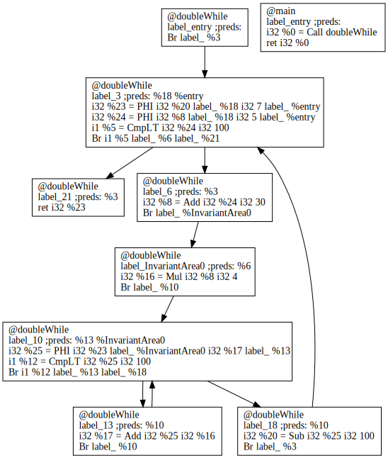
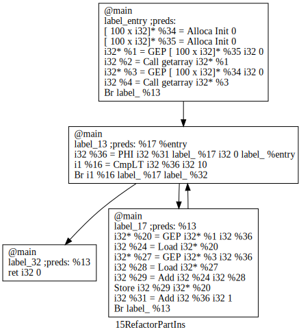

第八周周报

### Refactor Part Instructions

1、融合比较和分支指令

Fuse之前

```
i1 %5  = CmpLT i32 %4 i32 100 
Br i1 %5 <label> %6 <label> %21
```

Fuse之后

```
Br LT i32 %4 i32 100 <label> %6 <label> %21 
```

省掉了一个寄存器 %5

```
1c1
< >>>>>>>>>>>> After pass 17DeadCodeEliminate <<<<<<<<<<<<
---
> >>>>>>>>>>>> After pass 7LowerIR <<<<<<<<<<<<
20,21c20
<     i1 %5  = CmpGT i32 %18 i32 1073741824 
<     Br i1 %5 <label> %6 <label> %10 
---
>     Br GT i32 %18 i32 1073741824 <label> %6 <label> %10 
29,30c28
<     i1 %12  = CmpLT i32 %19 i32 0 
<     Br i1 %12 <label> %13 <label> %16 
---
>     Br LT i32 %19 i32 0 <label> %13 <label> %16 

```


2、融合加法和乘法

这利用ARM的一项指令集的特色：将位移（shift）和回转（rotate）等功能并成"资料处理"型的指令（算数、逻辑、和寄存器之间的搬移），举例来说，一个C语言的叙述（a 可能是一个数组的地址）

```
a = a + (j << 2);
```

在ARM之下，可简化成只需一个word和一个cycle即可完成的指令

```
ADD     Ra, Ra, Rj, LSL #2
```

举例来说

```assembly
@ i32 %24  = Load [ 100 x i32]* %35 i32 %36 i32 2 
ldr r3, [r1, +r0, lsl #2]
```

取数组变量时很常用


3、交换Phi的两个操作数，使得常数变量在后边

```bash
1c1
< >>>>>>>>>>>> After pass 11SimplifyCFG <<<<<<<<<<<<
---
> >>>>>>>>>>>> After pass 15RefactorPartIns <<<<<<<<<<<<
54,55c54,55
<     i32 %23  = PHI i32 7 <label> %entry i32 %20 <label> %18
<     i32 %24  = PHI i32 5 <label> %entry i32 %8  <label> %18 
---
>     i32 %23  = PHI i32 %20 <label> %18 i32 7 <label> %entry 
>     i32 %24  = PHI i32 %8  <label> %18 i32 5 <label> %entry 
```

为什么要这么做，看汇编

寄存器分配的结果是%23在REG0，%24在REG1

```assembly
.doubleWhile_entry_branch_1:
    @ %23 <= 
    @ %24 <= 
    mov r0, #7
    mov r1, #5
    @ branch instruction eliminated
.doubleWhile_3:
    @ i32 %23  = PHI i32 %20 <label> %18 i32 7 <label> %entry 
    @ i32 %24  = PHI i32 %8 <label> %18 i32 5 <label> %entry 
    @ Br LT i32 %24 i32 100 <label> %6 <label> %21 
    cmp r1, #100
    bge .doubleWhile_21+0
.doubleWhile_3_branch_1:
    @ branch instruction eliminated
.doubleWhile_3_branch_2:
    @ branch instruction eliminated
```

对于不是常数的PHI操作数

```assembly
.doubleWhile_18:
    @ i32 %20  = Sub i32 %25 i32 100 
    sub r0, r0, #100
    @ Br <label> %3 
.doubleWhile_18_branch_1:
    @ %23 <= %20
    @ %24 <= %8
    b .doubleWhile_3+0
```

实际上20和23同寄存器，8和24同寄存器，所以不需要赋值操作，只需要跳转


### 循环不变量

#### 查找

从最内层循环往外一层一层尝试外提

外提条件：某条运算指令的两个操作数在循环内不被定值：

`needDefinedInLoop`是循环中所有被定值指令的集合，初始化为循环中所有指令

算法是到达数据流分析，如果有某指令的所有操作数都在循环外有到达循环的定值，那么这条指令就是不变量，同时将用到该指令左值的地方也标记为不变量，迭代到不动点

```c
bool change = false;
do {
    change = false;
    for (auto BB : *loop) {
        for (auto ins_iter = BB->getInstructions().begin();
             ins_iter != BB->getInstructions().end(); ins_iter++) {
            bool allInvariant = true;
            auto ins = *ins_iter;
            if (ins->isPHI() || ins->isCmp() || ins->isBr() || ins->isCall() ||
                ins->isRet() || ins->isAlloca() ||
                needDefinedInLoop.find(ins) == needDefinedInLoop.end())
                continue;
            for (auto val : ins->getOperands()) {
                if (needDefinedInLoop.find(val) != needDefinedInLoop.end()) {
                    allInvariant = false;
                }
            }
            if (allInvariant) {
                needDefinedInLoop.erase(ins);
                invariant.push_back(std::make_pair(BB, ins_iter));
                change = true;
            }
        }
    }
} while (change);
```


#### 外提

```c
auto loopBase = finder->getLoopCond(loop);

BasicBlock *newBB =
    BasicBlock::create(m_, "InvariantArea" + std::to_string(areaCount++));
newBB->setParent(loopBase->getParent());

// mov invariant to new
for (auto pair : invariant) {
    Instruction *ins = *pair.second;		// 循环不变量指令
    pair.first->getInstructions().erase(pair.second);	// 旧BB中删除
    newBB->addInstruction(ins);			// 新BB中加入
}

// create br
BranchInst::createBr(loopBase, newBB);	// 在newBB中创建到loopBase的Branch

// Deal Phi
// Maintain pre & succ
```

外提前


外提后



### 创新多线程框架

具体过程：find + wrap

#### find

find的条件很多，简而言之，找到每个最内循环的最外层循环，然后看能否`MultiThreading`化

这个外层循环应该满足的条件是：

* 需要一个start到end的递增模式
* 分支指令应该是`Br Lt i32 Const <Label1> <Label2>`的形式
* 不能有其他Phi指令（迷，这样就限制了只能有一个循环变量


以矩阵赋值的例子，br是根据 i 和 n 的大小关系

Phi的四个操作数

1. i、递增变量
2. BB1、递增 i 的BB
3. Constant、100，循环边界
4. BB2、%entry


累加值：

```c++
auto accuVal = dynamic_cast<ConstantInt *>(accu->getOperand(1));
```

#### wrap

包装部分：在循环的条件Block之前插入MTstart，在更新迭代变量的之前插入MTend

```c
while (i<n){
	A[i] = A[i]+B[i];
}
```

插入多线程部分之前



插入之后：

```
%37: 多线程号 tid
%38: 问题规模 n
%40: _l = (n*tid)/4 
%43: _r = (n*(tid+1))/4
%44: _r + start		右边界
%48: (_l + step-1)/step * step + start		迭代变量初始值
```


MTend 部分主要修改Basic Block的连接

#### 多线程框架汇编码

最终结果

```assembly
define @main()
<label>entry:   level=0   preds=   succs=(%13)
    REG 4    [ 100 x i32]* %34  = Alloca 
    REG 1    [ 100 x i32]* %35  = Alloca 
    REG 0    i32 %2  = Call getarray [ 100 x i32]* %35 
    REG 0    i32 %4  = Call getarray [ 100 x i32]* %34 
    REG 10    i32 %37  = Call __mtstart 
 MT REG 2    i32 %39  = Mul i32 10 i32 %37 
 MT REG 0    i32 %41  = Add i32 %37 i32 1 
 MT REG 0    i32 %42  = Mul i32 10 i32 %41 
 MT REG 5    i32 %50  = AShr i32 %42 i32 2 
 MT REG 0    i32 %51  = AShr i32 %39 i32 2 
 MT REG 0    i32 %52  = Shl i32 %51 i32 0 
 MT          Br <label> %13 
<label>13:   level=1   preds=(%17 %entry)   succs=(%17 %MutithreadEnd0)
 MT REG 0    i32 %36  = PHI i32 %31 <label> %17 i32 %52 <label> %entry 
 MT          Br LT i32 %36 i32 %50 <label> %17 <label> %MutithreadEnd0 
<label>17:   level=1   preds=(%13)   succs=(%13)
 MT REG 3    i32 %24  = Load [ 100 x i32]* %35 i32 %36 i32 2 
 MT REG 2    i32 %28  = Load [ 100 x i32]* %34 i32 %36 i32 2 
 MT REG 2    i32 %29  = Add i32 %24 i32 %28 
 MT          Store i32 %29 [ 100 x i32]* %35 i32 %36 i32 2 
 MT REG 0    i32 %31  = Add i32 %36 i32 1 
 MT          Br <label> %13 
<label>MutithreadEnd0:   level=0   preds=(%13)   succs=
             Call __mtend i32 %37 
             ret i32 0 
```


基本寄存器对照表

|   ARM    |                 Description                 |           x86           |
| :------: | :-----------------------------------------: | :---------------------: |
|    R0    |               General Purpose               |           EAX           |
|  R1-R5   |               General Purpose               | EBX, ECX, EDX, ESI, EDI |
|  R6-R10  |               General Purpose               |            –            |
| R11 (FP) |                Frame Pointer                |           EBP           |
|   R12    |            Intra Procedural Call            |            –            |
| R13 (SP) |                Stack Pointer                |           ESP           |
| R14 (LR) |                Link Register                |            –            |
| R15 (PC) | <- Program Counter / Instruction Pointer -> |           EIP           |
|   CPSR   |    Current Program State Register/Flags     |         EFLAGS          |

多线程部分

```assembly
__mtstart:
    movw r11, #0
    movt r11, #256 				@ r11 = (256<<16) | 0
    sub sp, sp, r11
    push {r0, r1, r2, r3}
    mov r3, r7					@ 保留r7到r3
    mov r2, #4					@ thread numbers: 4
.__mtstart_1:
    sub r2, r2, #1				@ tid - 1
    cmp r2, #0
    beq .__mtstart_2+0			
    mov r7, #120				@ system call: clone
    mov r0, #273				@ clone_flags
    mov r1, sp					@ 线程之间共享栈空间
    swi #0
    cmp r0, #0					@ child theard ?
    bne .__mtstart_1+0			@ 父进程会继续clone子进程
.__mtstart_2:
    mov r10, r2					@ 保存当前r2(tid)到r10用于返回
    mov r7, r3					@ 恢复r7
    pop {r0, r1, r2, r3}
    movw r11, #0
    movt r11, #256
    add sp, sp, r11
    mov pc, lr					@ return
```

mtend

```assembly
__mtend:
    cmp r10, #0					@ parent theard ?
    beq .__mtend_2+0
.__mtend_1:						@ child theard:
    mov r7, #1					@ syscall: exit
    swi #0
.__mtend_2:						@ parent theard:
    push {r0, r1, r2, r3}
    mov r1, #4
.__mtend_3:
    sub r1, r1, #1
    cmp r1, #0
    beq .__mtend_4+0			@ parent theard end
    push {r1, lr}
    sub sp, sp, #4				
    mov r0, sp
    bl wait
    add sp, sp, #4
    pop {r1, lr}
    b .__mtend_3+0
.__mtend_4:
    pop {r0, r1, r2, r3}
    mov r10, #0
    mov pc, lr					@ exit
```

R14: PC R15: linker register

首先知道system call的约定

```
> man syscall 2
The first table lists the instruction used to transition to kernel
mode, the register used to indicate the system call number, the 
register used to return the sys‐tem call result, and the register 
used to signal an error.

arch/ABI    instruction           syscall #  retval  error    Notes
────────────────────────────────────────────────────────────────────
alpha       callsys               v0         a0      a3       [1]
arc         trap0                 r8         r0      -
arm/OABI    swi NR                -          a1      -        [2]
arm/EABI    swi 0x0               r7         r0      -
arm64       svc #0                x8         x0      -

Note:
[2] NR is the system call number.

The second table shows the registers used to pass the system call
arguments.

arch/ABI      arg1  arg2  arg3  arg4  arg5  arg6  arg7  Notes
──────────────────────────────────────────────────────────────
alpha         a0    a1    a2    a3    a4    a5    -
arc           r0    r1    r2    r3    r4    r5    -
arm/OABI      a1    a2    a3    a4    v1    v2    v3
arm/EABI      r0    r1    r2    r3    r4    r5    r6
arm64         x0    x1    x2    x3    x4    x5    -
```

然后man clone 2

```c
int clone(int (*fn)(void *), void *stack, int flags, void *arg, ...
          /* pid_t *parent_tid, void *tls, pid_t *child_tid */ );
```

Linux对线程的设计：线程只不过是共享虚拟地址空间和文件描述符表的进程，定义上线程之间共享除寄存器、栈、线程内本地存储（thread-local storage, TLS）之外的所有东西。

操作系统和底层硬件天然地保证了线程不会共享寄存器，TLS 不是必须的，本项目又使得线程之间共享栈空间，所以几乎没有切换开销

clone跟fork都是创建子进程（线程），区别在于clone能更详细的定制子进程和父进程共享的内容：如虚拟内存地址空间，文件描述符表，the table of signal handlers

clone对父进程返回所创建的子进程的tid，如果失败，返回-1

`clone_flags`的长度为8个字节，减去发送给父进程的信号代码的一个字节后剩下了7个字节用于传递进程复制信息，即可以同时设置7*8=56个标志位，也就是可以同时控制24种进程信息的复制。要设置某个标志位时只需要将其对应的取值与`clone_flags`进行或运算即可：

参考：[ARM-Thumb的 syscal 表](https://syscalls.w3challs.com/?arch=arm_thumb)

为啥clone_flags是273

273的32位二进制是0000000100010001，十六进制0x0111

[linux 2.6 sched.h](https://elixir.bootlin.com/linux/v2.6.32/source/include/linux/sched.h#L5)

```c
/*
 * cloning flags:
 */
#define CSIGNAL		0x000000ff	/* signal mask to be sent at exit */
#define CLONE_VM	0x00000100	/* set if VM shared between processes */
#define CLONE_FS	0x00000200	/* set if fs info shared between processes */
#define CLONE_FILES	0x00000400	/* set if open files shared between processes */
/*....*/
#define CLONE_NEWUSER		0x10000000	/* New user namespace */
#define CLONE_NEWPID		0x20000000	/* New pid namespace */
#define CLONE_NEWNET		0x40000000	/* New network namespace */
#define CLONE_IO		0x80000000	/* Clone io context */
```

在 [kernel/fork.c](https://elixir.bootlin.com/linux/v2.6.32/source/kernel/fork.c#L1212)

```c
/* ok, now we should be set up.. */
p->exit_signal = (clone_flags & CLONE_THREAD) ? -1 : (clone_flags & CSIGNAL);
p->pdeath_signal = 0;
p->exit_state = 0;
```

至于为啥最后两个数字是17

定义在 [arch/arm/include/asm/signal.h](https://elixir.bootlin.com/linux/v2.6.32/source/arch/arm/include/asm/signal.h#L48) 32个信号量

```c
#define SIGHUP		 1
#define SIGINT		 2
#define SIGQUIT		 3
#define SIGILL		 4
#define SIGTRAP		 5
#define SIGABRT		 6
#define SIGIOT		 6
#define SIGBUS		 7
#define SIGFPE		 8
#define SIGKILL		 9
#define SIGUSR1		10
#define SIGSEGV		11
#define SIGUSR2		12
#define SIGPIPE		13
#define SIGALRM		14
#define SIGTERM		15
#define SIGSTKFLT	16
#define SIGCHLD		17
//...
```


项目默认关闭多线程优化Pass

与经典框架 OpenMP 对比的优点

* 节约了栈开销：不需要将被并行化的区域拆分出来变成函数
* 节约了切换上下文：不需要保存上下文和维护各种信息
* 仅仅需要维护线程独有的寄存器